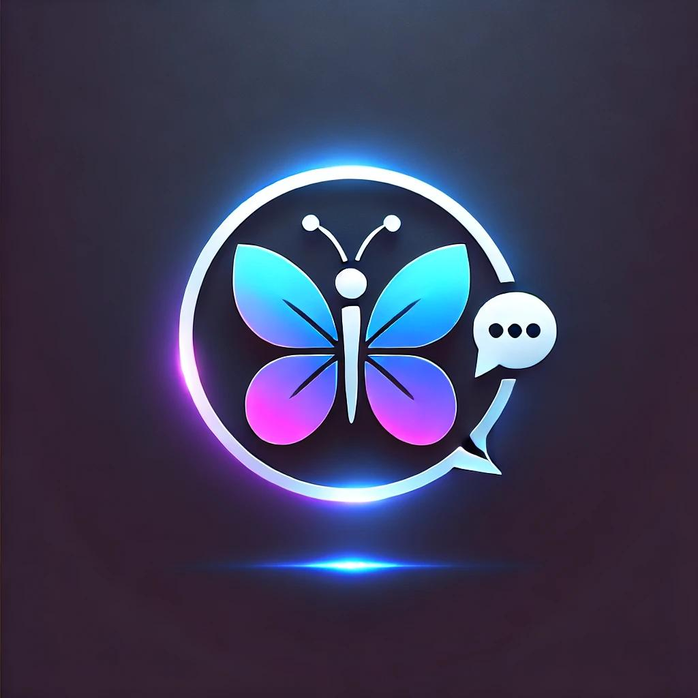

# Trisha:Intelligent Virtual Assistant

Trisha is an innovative virtual assistant that leverages voice interaction to simplify tasks such as studying, cooking, driving, and much more. By summarizing lengthy content and providing personalized results, Trisha ensures users can access relevant information efficiently, even while multitasking.

---

## 🚀 Features

- **Voice-Activated Interaction**: Control Trisha entirely hands-free.
- **Content Summarization**: Converts long blogs and articles into concise summaries.
- **Personalized Experience**: Delivers tailored results based on user preferences.
- **Accessibility Support**: Designed to assist visually impaired individuals.
- **Future Multilingual Support**: Plans to support multiple languages for global accessibility.

---

## 🎯 Use Cases

- **Students**: Simplify study sessions with quick summaries of complex topics.
- **Professionals**: Stay productive while multitasking during work.
- **Researchers**: Extract meaningful insights from large datasets or lengthy articles.
- **Accessibility Needs**: Empower visually impaired users to access and understand digital content.

---

## 📈 Why Trisha?

- Students spend an average of **6 hours daily** on academic tasks and struggle to process key information.  
  *(Source: EducationData.org)*

- Professionals lose focus by switching tasks every **3 minutes**.  
  *(Source: American Psychological Association)*

- Researchers spend up to **30% of their time** organizing data instead of analyzing it.  
  *(Source: Nature)*

- **15% of adults in the U.S.** have visual disabilities, limiting their access to digital information.  
  *(Source: National Federation of the Blind)*

---

## 🛠️ Tech Stack

- **Programming Language**: Python
- **Frameworks**: Langchain,Huggingface, Streamlit
- **VectorDB**: ChromaDB
- **GenAI**: RAG, GROQ, Gemini
  

---

## 🌟 Future Enhancements

1. Trisha will be a stand alone product, will have its own
mobile native apps.
2. Can hold and speak multiple languages.
3. Will be integrated with third party apps to become an all
round assistance
4. Next iteration of trisha will be able see and interact with
the world
---

### Prerequisites
- Python 3.10 or higher
- Required Python libraries:  
  Install using the command:
  ```bash
  pip install -r requirements.txt
